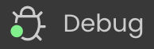

## Enabling rendering

Qodly Studio encapsulates Qodly pages, including layout, data connections, and event-driven logic, in a structured JSON file. This JSON file is processed on-the-fly by the **Qodly renderer** to serve a fully functional web page.

:::info

See [this page](../4DQodlyPro/rendering.md) for detailed information on how to render Qodly pages in Qodly.

:::

To enable the rendering of Qodly pages, the following options must be set.

* The 4D project's **Settings** > **Web** > **Web Features** > [**Expose as REST server**](https://developer.4d.com/docs/19/REST/configuration#starting-the-rest-server) option must be activated.
* The [4D web server](https://developer.4d.com/docs/WebServer/overview) must be running.

:::note

[Renderer buttons](../4DQodlyPro/rendering.md#page-rendering-options) are not available if the configuration options are not activated.

:::

## Scope of Qodly forms

When rendering Qodly forms in the Qodly Studio, the renderer will connect to the 4D web server through HTTP or HTTPS, depending on the settings, following the same HTTP/HTTPS connection pattern as for the [4D WebAdmin web server](https://developer.4d.com/docs/Admin/webAdmin#accept-http-connections-on-localhost). See also [this paragraph](#about-license-usage-for-rendering) about URL schemes and license usage.


Keep in mind that Qodly Studio runs through the 4D WebAdmin web server. When you use Qodly Studio as a developer, even when you preview a Qodly Page in the studio, you're using the 4D WebAdmin web server. This allows you to see dataclasses, functions and attributes that are not exposed as REST resources for example (they are greyed out).

However, page rendering happens outside Qodly Studio, and is served by the standard 4D web server. In this situation, your web application cannot access assets that are not exposed as REST resources. See [Exposed vs non-exposed functions](https://developer.4d.com/docs/ORDA/ordaClasses#exposed-vs-non-exposed-functions) and [Exposing tables](https://developer.4d.com/docs/REST/configuration#exposing-tables) for more information on how to expose assets.


## Accessing Qodly pages

For deployment, the WebAdmin server is not necessary. End-user access to your web application made with Qodly Studio is based on the 4D REST protocol, and as such, it works as through a conventional 4D remote application.

Your Qodly pages are available through the following url:

```
IP:port/$lib/renderer/?w=QodlyPageName
```

...where *IP:port* represents the address of the web server and *QodlyPageName* is the name of the Qodly page.  

For example:

```
https://www.myWebSite.com/$lib/renderer/?w=welcome
```

## Preview Qodly Application

You can preview your Qodly application at any moment by selecting the **Preview Qodly Application...** command in the **Windows** menu (4D Server) or in the **Design** menu (4D single-user). 

This command launches the Qodly renderer on a local address in your default browser and displays the **start page** [defined in the Application settings](https://developer.qodly.com/docs/studio/settings#start-page) of Qodly Studio.


## Using Qodly debugger on 4D Server

When using Qodly pages in a deployed 4D Server application (interpreted mode), you might encounter some cases where you need to debug your pages on the server, for example when a specific user configuration is required. In this case, you can attach the [Qodly Studio debugger](https://developer.qodly.com/docs/studio/debugging) to the 4D Server and then, benefit from its features when executing your Qodly pages.

Note that in this case, the Qodly Studio debugger will display all the code executed on the server, in accordance with the [attached debugger rule on 4D Server](https://developer.4d.com/docs/Debugging/debugging-remote#attached-debugger).  

To attach the Qodly Studio debugger to your running 4D Server application:

1. [Open Qodly Studio](#opening-qodly-studio) from 4D Server.

:::note

The project must be running in interpreted mode so that **Qodly Studio** menu item is available.

:::

2. In the Qodly Studio toolbar, click on the **Debug** button.<br/>


If the debug session starts successfully, a green bullet appears on the button label  and you can use the Qodly Studio debugger.

If the debugger is already attached to a another machine or another Qodly Studio page, an error is displayed. You have to detach it beforehand from the other location.

To detach the Qodly Studio debugger from your running 4D Server application:

1. Click the **Debug** button in the Qodly Studio toolbar while a debug session is active.
A warning dialog box will prompt you to confirm whether you want to detach the debugger.
2. Select **Keep in progress** to continue evaluating the code until the end of the current method or function before detaching the debugger, or **Stop** to detach the debugger immediately.


